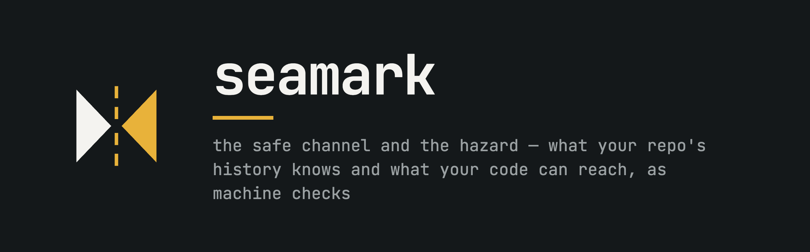

<p align="center">
  
</p>

<p align="center">
  <a href="LICENSE"></a>
  <a href="go.mod"></a>
  <a href="#get-started"></a>
</p>

**The graph your repo's history knows and your code's blast radius — served to your editor, your agents, and your CI.**

Seamark indexes which files *really* change together, why the weird parts
are weird, and which code paths can reach a database write, a process
spawn, or your production infrastructure. It serves that as editor
diagnostics, answers `why` on the CLI, and enforces your rules as
machine checks on agent commands — not as paragraphs in a prompt.
**Mistakes get caught instead of explained.**

> A *seamark* is a navigational marker that shows both the safe channel
> and the hazard.

- [Why seamark?](#why-seamark)
- [Get started](#get-started)
- [Ask why](#ask-why)
- [Editor integration](#editor-integration)
- [Guarding agents: the gate](#guarding-agents-the-gate)
- [Blast radius of a diff](#blast-radius-of-a-diff)
- [Keeping the index fresh](#keeping-the-index-fresh)
- [Extending the effect catalogue](#extending-the-effect-catalogue)
- [How it works](#how-it-works)
- [Honest limits](#honest-limits)
- [Status & roadmap](#status--roadmap)

## Why seamark?

Code-graph tools converged on one design: parse symbols, store a graph,
save tokens. Three problems stay unsolved by all of them:

| Problem | What seamark does about it |
|---|---|
| The graph knows *what* the code is, not *why* | Mines git history: empirical co-change (with lift), the commit trail per region, revert markers |
| Agents repeat mistakes; the fix is a prompt paragraph that costs tokens every turn and gets ignored | Rules are **checks**, evaluated at edit/run time; they cost nothing until violated |
| Agents cause real damage and the guardrails are regex denylists | A real shell parser + effect classification + policy over your declared environment, with an append-only audit log |

Measured on a real production monorepo (831 files, Python + TypeScript +
Go, 447 commits): full index in **~3s**; the strongest signal found was a
hand-synchronized Python↔TypeScript schema contract (38 shared commits,
lift 6.6) — invisible to every language server by construction, caught by
seamark as a save-time diagnostic. 598 symbols were found to transitively
reach a sink (DB write, process spawn, network egress).

Everything in the index is **falsifiable**: every edge traces to a parse,
a commit, or a policy file. No LLM-generated "insights" are ever stored.
100% local. No account, no API key, no telemetry.

## Get started

Requires Go ≥ 1.25 and a C compiler (tree-sitter uses CGO). Prebuilt
binaries and package-manager installs are planned; today it builds from
source:

```bash
git clone https://github.com/seamark-dev/seamark && cd seamark
make install        # builds and installs to ~/.local/bin/seamark
```

Then, in any repository:

```bash
seamark init        # scaffold config + wire the Claude Code agent hooks
seamark index       # parse + mine history + propagate effects (~seconds)
seamark why <symbol-or-file>
```

`seamark init` is optional but does the one-time setup for you: it writes
starter `.seamark/policy.yaml`, `.seamark/lessons.yaml` and
`.seamark/config.yaml` (never overwriting existing files), adds the
`.gitignore` carve-outs, and merges
the gate and review-lessons hooks into `.claude/settings.json` — leaving
any hooks you already have intact, and safe to re-run. Pass `--print` to
preview every change first.

The index is a single SQLite file under `.seamark/` — delete it to start
fresh, commit nothing.

## Ask why

`seamark why` answers the onboarding questions grep cannot — here run
on seamark's own gate:

```text
$ seamark why gate.EvalCommand
internal/gate.EvalCommand  (function)
  defined  internal/gate/gate.go:136
  sig      func EvalCommand(p *Policy, catalog *effects.Catalog, root, commandLine string) (*Decision, error)
  effects  proc:exec [depth 1]

callers (4)
  [qualified]     internal/cli.newGateCmd                      internal/cli/gate.go:21
  (+3 in tests)

calls (8)  — 3 resolved by name match only
  [unique-name]   internal/effects.Catalog.MatchCommand        internal/effects/effects.go:140
  [same-package]  internal/gate.gitPush                        internal/gate/gate.go:388
  ...

usually changed with  (empirical, lift > 1 means beyond chance)
   6/58  commits  lift 4.1   internal/effects/effects.go  · mostly MatchCommand, Load
recent decisions
  2026-07-26  ...  Implement Python parser
```

The `usually changed with` lines carry **function grain**: for each
partner, `· mostly …` names the functions that git's hunk headers show
were actually touched in the commits shared with this file — a factual
report of what moved together, not a statistical claim (function-level
*lift* would be noise; a function accumulates history ~10× slower than
its file).

Read it top to bottom: this function *can ultimately spawn a process*
(one hop away — it calls the push detector, which shells out to git to
resolve `HEAD`), here is its production surface (test callers collapse
to a count instead of burying it), and here is the commit trail.
Every call edge declares how it was derived (`[qualified]`,
`[same-package]`, `[same-class]`, or the low-confidence `[unique-name]`),
so you always know how much to trust an edge. On a repo with real
history, the `usually changed with` section is where the surprises live.

### Languages

| Language | Symbols & calls | Effect sinks | Notes |
|---|:-:|:-:|---|
| Go | ✓ | ✓ | multi-module monorepos supported |
| TypeScript / TSX / JavaScript | ✓ | ✓ | ES-module resolution, cross-file named imports |
| Python | ✓ | ✓ | relative imports, `__init__` packages, self/cls resolution |
| SQL, HCL | history layer only | planned | co-change needs no parser |

The history layer (co-change, decisions) is language-agnostic — it works
on every file git tracks.

## Learning from review history

Agents repeat mistakes. The same linter code, the same "use timezone-aware
datetimes," the same non-ASCII character keeps getting flagged in review
— by CodeRabbit, by Copilot, by a human — and the correction never sticks
past the session. `seamark index --reviews` mines your pull-request review
comments and clusters the recurrences into **lessons**:

```text
$ seamark why scripts/rollover.py
...
reviewers keep flagging  (recurring across pull requests)
  ×20     scripts                                [coderabbit]  E702
  ×6      scripts                                [coderabbit]  RUF001
  ×2      api/services                           [coderabbit]  reportArgumentType
```

A cited linter code clusters by directory (a habit, not one line); an
un-coded comment clusters by file and issue title, and a fingerprint
recurring across several files widens to their common directory —
repeated feedback is a habit of an area, not a property of one file.
Only patterns that recur (≥2) surface, region-scoped, so an agent
editing `scripts/` sees what reviewers keep catching there *before* it
makes the mistake again — through the same `why`/`orient` an agent
already calls, no extra tokens per turn and nothing bolted onto
CLAUDE.md.

Just as important is what is *not* a lesson. Thread replies are
conversation about a finding, never the finding — mining them once made
an author's "fixed" the top lesson of a real repo. Comments with nothing
actionable ("Very smart!", a bare link) are dropped rather than
clustered. And a linter code only counts when actually cited: not when a
matching token appears in quoted tool output (`rg -A10` once minted a
fake "A10" lesson from a bot's analysis script), and not in a repo that
doesn't contain the linter's language at all.

### Fixes are findings too

Review quality varies; **fix commits exist in every repository.** The
same `index --reviews` pass also mines them, purely from local git — no
GitHub needed at all: commits classified as fixes by explicit intent
(`fix:` subjects, `fixes #N` links, `Revert` commits; never substring
matches — "prefix" and "fixture" don't count), minus the ones that
teach nothing (typo/lint/CI chores, 30-file bulk refactors), minus
cherry-pick duplicates (patch identity: a backport is the same event)
and fixes that were later reverted. Each surviving fix becomes a
finding whose body carries the commit message *and the patch* — because
the patch is the signal that survives useless messages (measured: two
anonymous "fix: PR review" commits still grouped correctly on patch
content alone). Fix findings feed the distiller alongside review
findings — a fix and the review comments on its PR are counted as one
event — and power a deterministic hotspot line in `why`:

```text
fix density  9 of the last 20 commits here were fixes
```

phrased over a recent window so it decays as calmer history accumulates.

It's reviewer-agnostic (bots and humans travel the same path) and
best-effort: **review-comment** mining needs the GitHub CLI (`gh`)
authenticated and a github.com remote, and without them that half is
simply absent — fix findings keep coming from local git, offline and on
any remote, since the two sources degrade independently. Lessons refresh on the
review cadence — `--reviews` is opt-in, and a normal `seamark index` (and
every agent tool call) leaves them untouched rather than re-hitting the
network. A failed mine (offline, logged out) fails safe: it keeps the
lessons already stored rather than clearing them.

### Aware without being told

Having the lessons in `why`/`orient` only helps if an agent *asks*. To
make it automatic, wire the edit hook — a `PreToolUse` hook that injects
the relevant lessons the moment an agent is about to edit a file:

```json
{ "hooks": { "PreToolUse": [ {
  "matcher": "Edit|Write|MultiEdit",
  "hooks": [ { "type": "command", "command": "seamark lessons --hook" } ]
} ] } }
```

Now an agent editing anything under `scripts/` is told "reviewers keep
flagging E702, RUF001 here" whether or not it thought to check — a single
local index read, no network, silent for files with no lessons. (Proven:
a headless agent given a plain edit task with no mention of seamark still
named every flagged rule.)

### Tuning what surfaces

Like the gate's policy, a committed `.seamark/lessons.yaml` controls what
shows — applied at surface time, so edits take effect with no re-mining:

```yaml
threshold: 2                     # min recurrences to surface (default 2)
pin_budget: 3                    # pins the edit hook injects per edit (default 3)
mute:
  - rule: F541                   # hush a noisy rule everywhere
  - region: alembic/versions     # …or every lesson under generated code
pin:                             # your "must not be ignored" list —
  - rule: RUF001                 # surfaced always for its region, even if
    region: scripts              # mining found it once or never
    note: "Keep scripts ASCII — smart quotes have bitten us"
```

`mute` kills noise; `pin` is the escape hatch for a rule you care about
more than the mined frequency implies — written by hand, exactly like
policy.yaml rules (the distiller below can draft them, but never has
to). Both flow through `why`, `orient`, and the edit hook via one path,
so they never disagree.

Pins are powerful, so their injection cost is budgeted: the edit hook
carries at most `pin_budget` pins per edit (default 3), most specific
region first — a pin on the file beats its package beats a repo-wide
`*` — with a `+N more` pointer for the rest. Deliberate views (`--file`,
`why`) always show everything; only the ambient injection is capped.

You don't have to author this by hand. `seamark lessons --list` prints
every mined lesson — including the one-off noise that `why`/`orient` hide
— with the exact rule and region values to paste, and flags anything your
config already mutes:

```text
$ seamark lessons --list
review lessons (all mined, strongest first) — 436 total

  ×20   scripts                                        [coderabbit]          E702
  ×3    scripts                                        [coderabbit] (muted)  F541
  ×1    fetcher.py                                     [coderabbit]          bound the target close probe
  …
```

`--region <dir>` narrows the ledger to one area — its lessons and its
ancestors', one-offs included; agents on MCP reach the same view as
`expand lessons:<dir>`, and `why` advertises the ref whenever it shows
lessons. Reading a package's raw findings side by side is how a pattern
too varied for exact clustering gets spotted (ten differently-worded
"reset pooled state" findings are one lesson to a reader), whether the
reader is you or an agent you point at it — and the ledger's footer
tells that reader what to do with a spotted pattern: propose a pin for
review, never self-add it.

### Distilling patterns: plan → apply

Exact clustering can't see that ten differently-worded findings are one
mistake. `seamark lessons --distill` can: it batches the raw findings
into candidate groups and asks **your own agent CLI** (`claude` by
default — seamark holds no API keys) to name what recurs, as proposed
pins. It is an optional accelerator, nothing more: every entry it
drafts is one you could write by hand in the same file, and repos
without an agent CLI (or without the appetite for tokens) simply skip
it. Each run reports what it spent — per group and in total, estimated
tokens and wall time:

```text
$ seamark lessons --distill --region v2/pkg/engine
distilling 40 findings (v2/pkg, 1728e3d64e76a8ef)
  42s, ~5.3k tokens sent / ~433 back, 2 proposal(s)
distill plan — 50 groups: 3 read, 40 already distilled, 7 left for another run (raise --limit or drop --region)
agent traffic: ~15.9k tokens sent, ~1.2k received (estimated), 2m6s

proposed pins — distilled from review findings, awaiting YOUR decision

  p6    reset-reused-visitor-state   v2/pkg    2 findings cited [claude/v1]
        When a struct is reused across runs, reset all accumulated
        state — not just the primary field — before reusing it.

decide: `seamark lessons --apply p3,p7` (or a range: p1..p9) pins them; `--dismiss` remembers the no
```

The economics are engineered for repeated use: every group's evidence
set has a signature, a distilled signature is **never paid for twice**,
and a new finding reopens exactly its own group. `--limit` (default 10
groups) and `--region` budget each run — and a budgeted run spends its
calls where they are worth most, reading the groups whose evidence no
proposal has cited yet before the well-mined ones. Nothing is filtered
out: coverage changes the order, never the corpus, because dropping
evidence could starve a genuinely new pattern of the recurrence it
needs. Each batch also arrives knowing the rule *labels* already pinned
for its area, so the call looks past them — labels only, since carrying
the notes would cost more tokens than the duplicates they prevent. Dismissals are permanent memory;
a pattern only returns if its evidence changes.

Candidate groups are read independently, so a repo-wide mistake shows up
in several of them — and a distiller with no memory would re-propose it
under a new name every time (measured on a real repo before this check:
65 applied pins carried only 50 distinct themes). Every distilled
pattern is therefore compared against what is already captured — your
pins, hand-written ones included, and every proposal already pending,
applied, or **dismissed** — and a restatement is dropped before it
reaches the ledger. The check is deterministic and costs nothing: no
agent call is needed to see that two short rules say the same thing.
`seamark lessons --proposals` audits the pins you already have the same
way: it names each near-duplicate cluster, suggests which entry to keep
(the one resting on the most evidence), and hands you the command —
`seamark lessons --prune p16,p45` — to retire the rest. Pruning is not
dismissal: the theme stays pinned by its survivor and the distiller
still counts it as known, where a dismissal would suppress it. Like
`--apply`, it edits `lessons.yaml` only with `distill.write` set, it
removes each entry with its provenance comment and nothing else, and it
refuses to write at all unless the result still parses with every other
pin intact.

And it is proposal-only by construction: the model must cite the finding
ids behind every pattern (uncited patterns are dropped — it cannot
invent evidence), regions are computed from the cited files, and nothing
reaches `.seamark/lessons.yaml` except through an explicit `--apply` of
explicit ids. Even then, seamark edits the file itself only if
`config.yaml` opts in (`distill: {write: true}`) — otherwise apply
prints the pin block for you to paste. Applied entries are inserted
under your existing `pin:` section with provenance comments; everything
hand-written stays byte-for-byte.

### Is it working? `lessons --stats`

The edit hook appends a line to `.seamark/lessons-audit.jsonl` each time
it reminds an agent — the impact/decay counterpart to the gate's audit
log. `seamark lessons --stats` turns that into which lessons actually
reach agents, and which *would* surface but never have (a lesson whose
region no edit touches is a pruning candidate):

```text
$ seamark lessons --stats
lesson firings — 128 edits reminded across 24 files

most surfaced
  ×41  scripts                                  last 2026-07-26  E702
  ×18  scripts                                  last 2026-07-26  RUF001
  …
never fired — 7 lessons in regions no edit has touched (decay candidates)
  tests                                    E741
  …
```

### Reviewing it all: `seamark report`

Agents read the compact text reports over MCP. The person who has to
decide what the repo should actually *remember* needs a different
surface — everything at once, in one place:

```bash
seamark report            # → .seamark/report.html
seamark report --open     # ...and open it
seamark report -o - > /tmp/audit.html
```

One self-contained HTML file — no server, no assets, nothing fetched
when it is opened — so it can be attached to a pull request or read on a
machine with no network. Four sections:

- **Decision queue** — every proposal awaiting `--apply`/`--dismiss`,
  with the findings it cited (click through to the original review
  comment) and the commands that decide it. The header line says what
  the evidence rests on: *469 review · 34 fix:conventional · 15
  fix:subject*.
- **Near-duplicate pins** — which *applied* pins restate a theme already
  pinned. This is the audit that found 17 redundant pins out of 65 in a
  real repo, and the reason `lessons --prune` exists.
- **Hotspot map** — the files seamark parsed, grouped by directory: area
  is how much history a file carries, colour is what share of its recent
  commits were corrections. Same fix-density definition `why` prints, so
  the two surfaces never disagree. Click a cell to filter the lessons
  below to that region.
- **Lessons** — every mined lesson including the one-offs, filterable
  and sortable. The raw material for tuning `lessons.yaml`.

The page is a snapshot: it stamps the index state it was built from,
warns inside the file when the workspace has moved on since, and says so
whenever a list was truncated. All quoted text — review comments, commit
subjects, model-written notes — is escaped, never rendered as markup.

## Editor integration

`seamark lsp` is a secondary language server that runs *alongside* gopls,
pyright, or tsserver — it adds the layer they cannot see:

- **Hover** — signature, caller count with confidence, effect reach
  ("Reaches `db:write` (2 hops)"), co-change partners, recent commits.
- **Code lenses** — caller counts per function; a file-level coupling
  headline.
- **Diagnostics on save** — the co-change omission check: *"usually
  changed together, not in this change: src/api/schema.ts (38/58
  commits, lift 6.6)"*. Conservative thresholds by design; a diagnostic
  that nags gets disabled.

Setup for Neovim (0.9+) and VS Code: see [docs/editors.md](docs/editors.md)
and the ready-made configs in [editors/](editors/).

## Agent integration: the MCP server

`seamark mcp` speaks the Model Context Protocol over stdio. Five tools,
not forty — tool definitions are replayed to the model on every turn, so
a sprawling "token-saving" server defeats itself:

| Tool | Answers |
|---|---|
| `orient` | one-screen repo overview: modules, most-called API, change hubs, recent decisions |
| `why` | everything about a symbol or file: callers with confidence, co-change, commits |
| `change_set` | pre-edit: what history says changes together with your planned files |
| `check` | a diff's reachable effects and the policy verdict |
| `expand` | progressive disclosure: turn any ref a report returned into its content — source lines, or `lessons:<dir>` for an area's raw review findings |

Register it in Claude Code by dropping an `.mcp.json` at the repo root
(this repository ships one):

```json
{"mcpServers": {"seamark": {"command": "seamark", "args": ["mcp"]}}}
```

Every tool call re-checks the workspace fingerprint first and re-indexes
if anything changed, so answers never come from a stale graph. The
server also exposes the orientation as an MCP resource and an `onboard`
prompt that walks an agent through the repo cheapest-signal-first.

A typical agent exchange, on this repository's own history:
`change_set(["internal/gate/gate.go"])` answers with the files that
historically ship alongside gate changes and the effect tags the edit
can reach — the "what am I about to forget?" question, answered from
evidence before the first line is written.

## Guarding agents: the gate

`seamark gate` classifies a shell command's effects and evaluates your
policy **before the command runs** — built for agent pre-execution hooks
and CI:

```bash
$ KUBECONFIG=~/.kube/prod.yaml seamark gate --command "terraform apply -auto-approve"
verdict  deny (mode: warn)
effects  [infra:mutate]
  [deny] no-prod-infra-mutation: infrastructure mutation against a production environment requires a human
```

What makes it more than a denylist:

- **A real shell parser** (`mvdan.cc/sh`) — every command in pipelines,
  `&&`-chains, and `$(substitutions)` is classified; unparseable input
  fails closed.
- **Indirection is detected, not missed** — `$TOOL apply` cannot be
  classified, so it is flagged as *dynamic* and policy decides; this is
  exactly the trick that walks through regex denylists.
- **Wrappers unwrap** — `sudo -E env FOO=bar kubectl delete` classifies
  as kubectl.
- **Subcommand-aware** — `terraform plan` passes, `terraform apply` does
  not; an argument merely *named* "apply" does not trigger.
- **Environment-aware** — `env.is_prod` derives from the variables you
  declare (`KUBECONFIG`, `DATABASE_URL`, …) and your prod markers.

Policy is CEL over `effect`, `command`, `env`, and `diff`, in
`.seamark/policy.yaml`:

```yaml
mode: warn          # report only; flip to "enforce" when the rules have earned trust
deny:
  - id: no-prod-infra-mutation
    when: 'effect.contains("infra:mutate") && env.is_prod'
    message: infrastructure mutation against production requires a human
require_approval:
  - id: prod-db-write
    when: 'effect.contains("db:write") && env.is_prod'
    message: database write against a production environment
```

Ships in **warn mode**: run it for a week, read the audit log, see what
*would* have been blocked, then opt into `enforce` (exit code 2 blocks
the caller — hook- and CI-friendly).

### As a Claude Code hook

`seamark init` wires this into `.claude/settings.json`:

```json
{
  "hooks": {
    "PreToolUse": [{
      "matcher": "Bash",
      "hooks": [{
        "type": "command",
        "command": "seamark gate --hook"
      }]
    }]
  }
}
```

`--hook` reads the PreToolUse JSON from stdin natively — no jq. By
default the hook follows the mode in `.seamark/policy.yaml` (warn), so
**a first install never blocks a command**. Opting in with
`seamark init --gate-mode enforce` bakes `--enforce` into the hook:
deny/require_approval verdicts exit 2 and block, and the gate **fails
closed** — a malformed payload, a broken policy file, or an internal
error blocks the command instead of silently allowing it. Re-running
`init` without `--gate-mode` keeps whatever mode is installed, and every
run ends with a `gate` line stating the effective behavior.

The agent sees the denial reason and corrects course; you see every
decision in `.seamark/audit.jsonl` — an append-only trail of what your
agents attempted, when, and why it was allowed or blocked.

## Blast radius of a diff

```bash
git diff | seamark check          # or: seamark check   (uses git diff HEAD)
```

Changed lines map to symbols; symbols carry transitively-propagated
effect tags; the union is what the change can *ultimately* reach — even
when the edited function never touches a sink itself. Policy rules over
`diff.effects` gate merges the same way `gate` gates commands.

## Keeping the index fresh

Seamark fingerprints the workspace (HEAD + `git status`, hashed) every
time the index is built, so every surface knows whether its answers are
current — and reacts according to what a stale answer would cost:

| Surface | Freshness behavior |
|---|---|
| Editor (LSP) | Automatic: every save reindexes and republishes diagnostics; no-change saves are free |
| `seamark check` | **Self-repairs**: missing or stale index is rebuilt before evaluating — a blast radius from stale line spans would be a wrong safety answer |
| `seamark gate` | Never needs the index (catalogue + policy only); always current |
| `seamark why` | Answers immediately, with a stderr note when the workspace changed since the last index |
| `seamark report` | Same note, plus a banner **inside the file** — a report outlives the terminal that produced it |
| `seamark index` | No-ops in well under a second when nothing changed (`--force` rebuilds) — running it "just in case" is free |

When the workspace *has* changed, a **content-hashed per-file parse
cache** means only the files that actually changed are re-parsed — the
rest are served from cache. Tree-sitter parsing is ~60% of index time, so
this is the big lever: on the 831-file monorepo, a one-file edit
reindexes in **~1.3s instead of ~3.2s**, and the result is byte-identical
to a full rebuild (resolution and effect propagation always run globally
— they are nearly free, and global exactness is what makes edges
trustworthy). `seamark index` reports it:

```text
files    832 seen, 703 parsed — 1 reparsed, 702 from cache
```

A first index (or `--force`) is a full parse: ~3.2s for the monorepo,
~150ms for a small repo. The fingerprint check itself is ~30ms.

### Planned: further incremental work

Measured breakdown of a full 3.2s index: parse 1.8s (now cached),
history mining 0.7s, SQLite write 0.4s, resolution 0.003s. With parse
cached, history and write are the remaining costs. The roadmap
(see [docs/PLAN.md](docs/PLAN.md)):

1. **History watermark** — mine only commits since the last run
   (`git log <last-sha>..HEAD`) with counter-based co-change updates,
   removing the 0.7s.
2. **`seamarkd` daemon** — fsnotify watching with debounced incremental
   refresh and delta writes; the LSP becomes a thin client and freshness
   becomes keystroke-adjacent instead of save-adjacent.
3. **Incremental resolution** — dependency-tracked edge invalidation,
   deliberately deferred until a very large monorepo demands it: the
   lowest-confidence resolution tier is nonlocal (a new method named `X`
   anywhere can invalidate an edge elsewhere), and cheap exactness beats
   clever approximation until the numbers say otherwise.

## Choosing what gets indexed

The indexer skips two things by default: anything `.gitignore` ignores,
and files carrying the conventional `Code generated … DO NOT EDIT.`
header (protoc, stringer, mockgen, …) — generated code inflates the
graph and pollutes most-called lists without ever being hand-navigated.
A committed `.seamark/config.yaml` tunes both:

```yaml
index:
  generated: true      # index generated files after all
  exclude:             # extra paths to skip, on top of .gitignore
    - "*.pb.go"        # basename glob, any directory
    - "internal/gen/"  # directory prefix
    # - "**/*_test.go" # uncomment for a production-only graph
```

Skipped files are counted in the `seamark index` output, and a malformed
config — including an exclude glob that could never match — fails the
index loudly rather than being silently ignored. Config edits count as
workspace changes, so the next `seamark index` (or any self-repairing
surface) picks them up automatically.

## Extending the effect catalogue

Effect knowledge is data, not code. The built-in catalogue covers ~40
sinks across Go, Python, and JS/TS plus common CLI tools; your workspace
extends it additively in `.seamark/effects.yaml`:

```yaml
sinks:
  - language: python
    import: my_company_infra
    names: [apply, provision]
    tag: infra:mutate
commands:
  - name: my-deploy-tool
    subcommands: [rollout]
    tag: infra:mutate
```

Custom tags propagate up the call graph and participate in policy exactly
like the built-ins.

## How it works

```text
  sources                     seamark                      surfaces
┌──────────┐      ┌───────────────────────────┐      ┌──────────────┐
│ source   │─parse─▶ symbols / calls / imports │────▶ │ LSP  (stdio) │
│ tree     │      │                           │      ├──────────────┤
├──────────┤      │  co-change (lift) +       │────▶ │ CLI / hooks  │
│ git log  │─mine──▶ decisions per region      │      ├──────────────┤
├──────────┤      │                           │────▶ │ MCP (planned)│
│ .seamark/ │─load──▶ effect propagation to     │      └──────────────┘
│ yaml     │      │  fixpoint + CEL policy    │
└──────────┘      └────────── SQLite ─────────┘
```

One binary, one SQLite file, no daemon required. Parsing is tree-sitter;
call edges are resolved syntactically and **labeled with their
derivation** so consumers can filter by confidence. Effects seed from the
catalogue at call sites (including calls into external dependencies) and
propagate backwards along call edges to fixpoint, with depth.

## Honest limits

- Call resolution is syntactic, not type-checked. gopls will always be
  better at *find references* within one language — that is not the
  game. Low-confidence edges are labeled `[unique-name]` and test
  doubles are excluded from that tier.
- A local variable shadowing an import alias can produce a wrong edge
  (declared as such via its origin label). Scope tracking is future work.
- Python's DB-API has no syntactic read/write split, so `cursor.execute`
  tags conservatively as `db:write`.
- Co-change needs history: on a young repo the empirical layer is thin
  until commits accumulate.
- Seamark is a navigator, not an oracle. It tells you where to look and
  what usually travels together; "usually changes with" is empirical
  evidence, never a guarantee that *your* edit is safe or complete. For
  a pinpoint lookup of a known symbol, a plain file read is cheaper —
  seamark earns its round-trip on orientation, risk, and history
  questions.

## Status & roadmap

Working today: indexer (Go/TS/JS/Python), history mining, effects +
propagation, LSP server, gate + check + audit, Claude Code hook, MCP
server (`orient`, `change_set`, `why`, `check`, `expand` + resource +
prompt), review-comment lessons (`index --reviews`). Planned next (see
[docs/PLAN.md](docs/PLAN.md)): zero-token check promotion from recurring
lessons, function-grain history enrichment, `seamarkd` daemon with
incremental indexing, prebuilt binaries + npm/Homebrew distribution.

## Development

```bash
make test     # full suite (testify)
make lint     # golangci-lint
make index    # self-index this repo
```

Contributions that need no Go at all: the effect catalogue and default
policy are plain YAML — adding sinks for your framework is a
ten-line PR.

## License

Apache-2.0. See [LICENSE](LICENSE).
