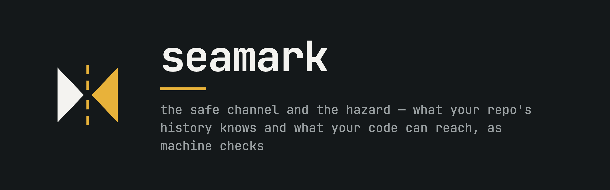

<p align="center">
  
</p>

# Seamark

**Stop your AI coding agent from repeating the same mistakes.**

Your repository already contains lessons from past bugs, fixes, and code
reviews. Seamark brings those lessons into your AI coding agent's next change.

Review proposed lessons, keep the ones that matter, and let Seamark remind
your agent when it edits relevant code. MCP tools and agent skills also help
it understand past decisions and find related files that may need updating.

[Get started](#get-started) · [Learn from your repository](#learn-from-your-repository) · [Agent skills](#agent-skills) · [Documentation](#documentation)

<p>
  <a href="LICENSE"></a>
  <a href="docs/getting-started.md"></a>
</p>

## Why Seamark?

You fix a bug. A reviewer explains the mistake. In the next session, your AI
coding agent makes it again. The correction is in your history, but it never
reaches the agent when it matters.

Seamark helps you put that knowledge to work:

- **Learn from your own repository.** Turn past fixes and code review feedback
  into proposed lessons, with links back to the evidence. You decide what to keep.
- **Bring lessons to the next edit.** Hooks deliver relevant reminders when
  your AI coding agent edits matching files, including in a new session.
- **Find changes that belong together.** Use Git history to spot a generated
  client, another implementation, or a test that often changes with your code.
- **Keep the knowledge with your project.** Accepted lessons live in a YAML
  file you can review and commit. Seamark has built-in integrations for
  Claude Code and Codex, with a shared framework for adding more AI coding agents.

For example, a reviewer may have explained that changing a backend schema
also requires regenerating the frontend client. Seamark can propose a lesson
from that feedback and deliver the accepted reminder when the agent edits the
relevant code again. You do not have to remember to repeat the correction in
every task prompt.

## Get started

These instructions are for **v0.7.0 or newer**.

Install the latest published version on macOS or Linux:

```bash
brew install seamark-dev/tap/seamark
seamark version
```

Open a repository with Git history and choose **one** setup command:

```bash
cd your-project

# Claude Code
seamark init --client claude --skills --approve-tools

# Codex
seamark init --client codex --skills --approve-tools
```

This connects Seamark's MCP tools, installs the three agent skills, and sets
up lesson and command hooks. `--approve-tools` adds tool permissions while
preserving existing restrictions. New repositories start with command checks
in warn mode; they do not block commands. Existing policy settings are preserved.

Build the index and check the setup:

```bash
seamark index
seamark doctor
```

Open or restart your AI coding agent in the repository. In Codex, accept the
project trust prompt if you trust the repository, then review the Seamark
hooks with `/hooks` in the Codex CLI. Tool permissions do not grant hook trust.
See [agent setup](docs/agent-integrations.md) for compatibility and troubleshooting.

Try asking:

> Use Seamark to explain this repository's main areas and recent decisions.
> Which files often change together?

You should get an overview based on your code and Git history. You can also
run `seamark orient` yourself. Lesson reminders start when there are relevant
lessons to deliver; the next section shows how to collect them.

[Other installation options and setup help →](docs/getting-started.md)

## Learn from your repository

The learning workflow is simple:

**Past fixes and reviews → proposed lessons → your review → reminders during edits.**

Start with fixes from local Git history:

```bash
seamark index --fixes-only
seamark lessons --list
```

To include GitHub pull-request review comments, use `seamark index --reviews`
instead. That requires the GitHub CLI (`gh`) authenticated for the repository.
A new repository or one with little relevant feedback may have few findings.
You can also [write a lesson by hand](docs/lessons.md#tuning-what-surfaces-lessonsyaml).

To turn findings into proposed lessons, Seamark can use your installed AI
coding agent CLI. Claude Code is the default. For Codex, set `agent.cli: codex`
in `.seamark/config.yaml` as shown in the
[inference setup guide](docs/agent-integrations.md#choose-an-agent-for-inference).
This is separate from choosing an agent during `init`.

```bash
seamark lessons --distill --dry-run   # preview the command and estimated input
seamark lessons --distill --limit 1   # process one group through your AI agent CLI
seamark lessons --proposals          # review the proposed lessons and evidence
```

Lesson generation uses your agent's model access and may incur usage charges.
It does not install anything automatically. Review a proposal's wording,
evidence, and file scope, then choose its ID:

```bash
seamark lessons --apply p1           # replace p1 with an ID you reviewed
```

By default, this prints a YAML block. Paste it under `pin:` in
`.seamark/lessons.yaml` and commit that file to share the lesson. To let
`--apply` write the file and record the decision for you, enable
[`distill.write`](docs/configuration.md#configuration) first.

Inspect what applies to a file with `seamark lessons --file path/to/file`.
Your configured hooks deliver matching reminders during supported edits.
`seamark report --open` opens a local report of proposals and accepted lessons;
`seamark lessons --stats` shows which reminders have been delivered.

[Learning guide: review, tune, dismiss, and update lessons →](docs/lessons.md)

## Agent skills

[Agent skills](https://agentskills.io) give your AI coding agent instructions
for common tasks. Seamark includes three skills for Claude Code and Codex.
They explain when to use Seamark's tools and how to interpret the results.

| Skill | Helps your AI coding agent… |
| --- | --- |
| `seamark-understand-repo` | Explore unfamiliar code and understand past decisions. |
| `seamark-plan-change` | Find related files, possible side effects, and past review feedback before editing. |
| `seamark-review-change` | Review the diff, check for missed companion files, and revisit relevant lessons. |

For example, when you ask an agent to change an API across several files,
the planning skill tells it to check which other files usually change with
them. This can reveal a generated client or another implementation that
needs attention.

The quick start installs the skills with `--skills`. They are optional, and
small tasks such as typo fixes do not require a repository overview.
After upgrading Seamark, repeat your setup command to refresh managed copies.

[Skill installation and customization →](skills/README.md)

## MCP tools

MCP (Model Context Protocol) lets your AI coding agent call Seamark for
repository evidence. The setup commands above register the server, which
runs locally as `seamark mcp`.

| Tool | What it helps answer |
| --- | --- |
| `orient` | Where should I start in this repository? |
| `why` | Why is this code here, what calls it, and what usually changes with it? |
| `change_set` | What related files and lessons should I check before editing? |
| `check` | What can this diff affect, and what lessons or related files did I miss? |
| `expand` | Can I see the source or review findings behind this result? |

The server refreshes the code index when the workspace changes. Refresh
review evidence explicitly with `seamark index --reviews` or `--fixes-only`.
Skills guide the workflow; MCP supplies evidence; hooks deliver reminders.
Lessons are advice, and your tests and review still matter.

## See it in action

An OpenTelemetry-Go case study follows a real history of histogram bugs:
learn that parallel implementations need consistent reset behavior, review
the proposed lesson, then deliver it during a later edit.

In the associated controlled benchmark, the agent preserved that behavior
in **5 of 5 runs with the lesson delivered at the relevant edit, versus
0 of 5 without it**. This result covers one historical task and a fixed
model/runtime; it does not predict results for every repository.

[Read the case study](docs/case-studies/opentelemetry-histogram-reset.md) ·
[Inspect the benchmark](bench/otel-report-v7.md)

## Support and direction

Code analysis supports **Go, Python, and TypeScript/JavaScript**. Git history
analysis works across tracked file types. History is most useful in a
repository with enough commits to show recurring patterns.

The current focus is lessons and proposals, MCP tools, and agent skills.
Built-in AI coding agent integrations cover Claude Code and Codex, with
[capabilities and verification limits](docs/agent-integrations.md#what-each-agent-supports)
listed per agent. The shared integration framework makes Seamark independent
of any single AI coding agent; support for additional agents requires an adapter.

**Policies are experimental and awaiting refinement.** Command checks and
diff policies are available, but they are not the main onboarding path.
See the [policy guide](docs/policies.md) before enabling enforcement.

Next, we plan to build on lesson delivery and the agent integration framework
with unified hook management. This is future work, not part of v0.7.0.
See [current status](docs/STATUS.md) and the [changelog](CHANGELOG.md).

## Privacy and local data

Seamark's code and history index runs locally. Seamark has no account
requirement and sends no telemetry. GitHub review mining uses your `gh`
login; optional lesson generation uses your AI agent CLI. Evidence provided
through MCP or hooks may also reach your agent's model provider.
See [data flow](docs/data-flow.md) for the details.

Keep `.seamark/index.db`: it also stores proposal decisions and lesson-generation
history. Use `seamark state export` to back up that state. Accepted lesson
YAML can be committed separately. [Configuration and backups →](docs/configuration.md)

## Documentation

- [Installation and first use](docs/getting-started.md)
- [AI coding agent setup and compatibility](docs/agent-integrations.md)
- [Lessons and proposals](docs/lessons.md)
- [Repository history and code analysis](docs/repository-history.md)
- [Configuration and local state](docs/configuration.md)
- [Data flow](docs/data-flow.md) and [trust boundaries](docs/threat-model.md)

## Contributing

Contributions are welcome. You can improve docs, contribute an
[AI coding agent integration](docs/agent-integrations.md#adding-an-agent), or
extend the [effect catalogue](docs/configuration.md#effect-catalogue).

Source builds need Go 1.25 or newer and a C compiler:

```bash
make test
make lint
make build
make smoke
```

See the [Makefile](Makefile) for additional checks and benchmark commands.

## License

[Apache-2.0](LICENSE).
